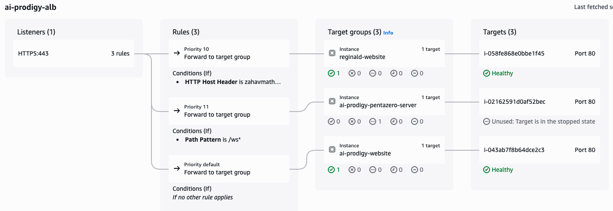
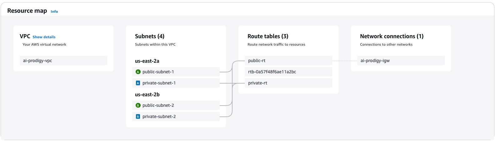

# AI Prodigy – Production AWS Architecture

## Highlights
| Component | Description |
|-----------|-------------|
| VPC (2 AZ) | 2 public + 2 private subnets |
| ALB        | Routes `/api` to WebSocket backend |
| NAT Instance | Replaces NAT Gateway to reduce cost |
| VPC Endpoints | Connect to ECR, S3, Secrets Manager securely |
| RDS Postgres | Encrypted, used for user/session data |
| EC2 Auto Scaling | Hosts Dockerized app containers |

## Cost Optimization

We replaced a managed NAT Gateway (~$0.045/hr) with a `t3.micro` EC2 NAT instance (~$0.01/hr) + interface VPC endpoints for ECR, Secrets Manager, and SSM, resulting in:

- Monthly networking cost savings of ~**40%**
- Faster pull times from ECR
- No impact on uptime

## Uptime

Zero downtime achieved using:
  - **Multi-AZ ALB** distributing traffic across private-subnet EC2 instances.
  - **Rolling updates via Auto Scaling:** each new instance boots with a cloud-init **user-data script** that  
    1. pulls the correct Docker image from ECR,  
    2. runs container-level health checks,  
    3. registers with the ALB target group only after passing.
  - ALB health checks drain old instances before termination, so no open
    connections are dropped.
  - Auto Scaling automatically replaces any unhealthy instance to keep
    capacity steady without manual intervention.
  
## ALB Road Map

## VPC Road Map

