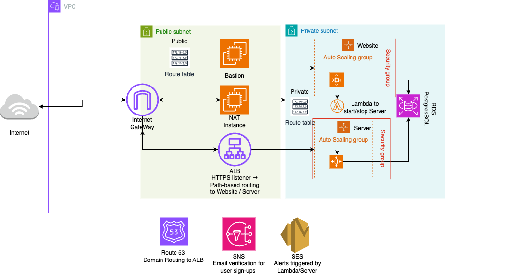

# AI Prodigy – Production AWS Architecture

## Highlights
| Component | Description |
|-----------|-------------|
| VPC (2 AZ) | 2 public + 2 private subnets |
| ALB        | Routes `/api` to WebSocket backend |
| NAT Instance | Replaces NAT Gateway to reduce cost |
| VPC Endpoints | Connect to ECR, S3, Secrets Manager securely |
| RDS Postgres | Encrypted, used for user/session data |
| EC2 Auto Scaling | Hosts Dockerized app containers |

## Cost Optimization

We replaced a managed NAT Gateway (~$0.045/hr) with a `t3.micro` EC2 NAT instance (~$0.01/hr) + interface VPC endpoints for ECR, Secrets Manager, and SSM, resulting in:

- Monthly networking cost savings of ~**40%**
- Faster pull times from ECR
- No impact on uptime

## Uptime

Zero downtime achieved using:
- **Blue-green deployment** through GitHub Actions + SSM
- Separate target groups for each EC2 pool
- Health checks before swap

## Next Steps

See [ci-cd-pipeline](https://github.com/yourusername/ci-cd-pipeline) for the automation repo.
